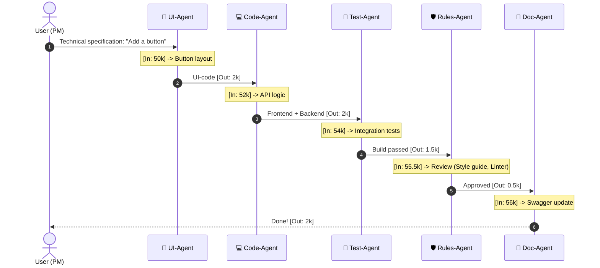

```mermaid
sequenceDiagram
    autonumber
    actor User as User (PM)
    participant UI_Agent as 🎨 UI-Agent
    participant Code_Agent as 💻 Code-Agent
    participant Test_Agent as 🧪 Test-Agent
    participant Rules_Agent as 🛡️ Rules-Agent
    participant Doc_Agent as 📝 Doc-Agent
    User->>UI_Agent: Technical specification: "Add a button"
    note over UI_Agent: [In: 50k] -> Button layout
    UI_Agent->>Code_Agent: UI-code [Out: 2k]
    note over Code_Agent: [In: 52k] -> API logic
    Code_Agent->>Test_Agent: Frontend + Backend [Out: 2k]
    note over Test_Agent: [In: 54k] -> Integration tests
    Test_Agent->>Rules_Agent: Build passed [Out: 1.5k]
    note over Rules_Agent: [In: 55.5k] -> Review (Style guide, Linter)
    Rules_Agent->>Doc_Agent: Approved [Out: 0.5k]
    note over Doc_Agent: [In: 56k] -> Swagger update
    Doc_Agent-->>User: Done! [Out: 2k]
```
