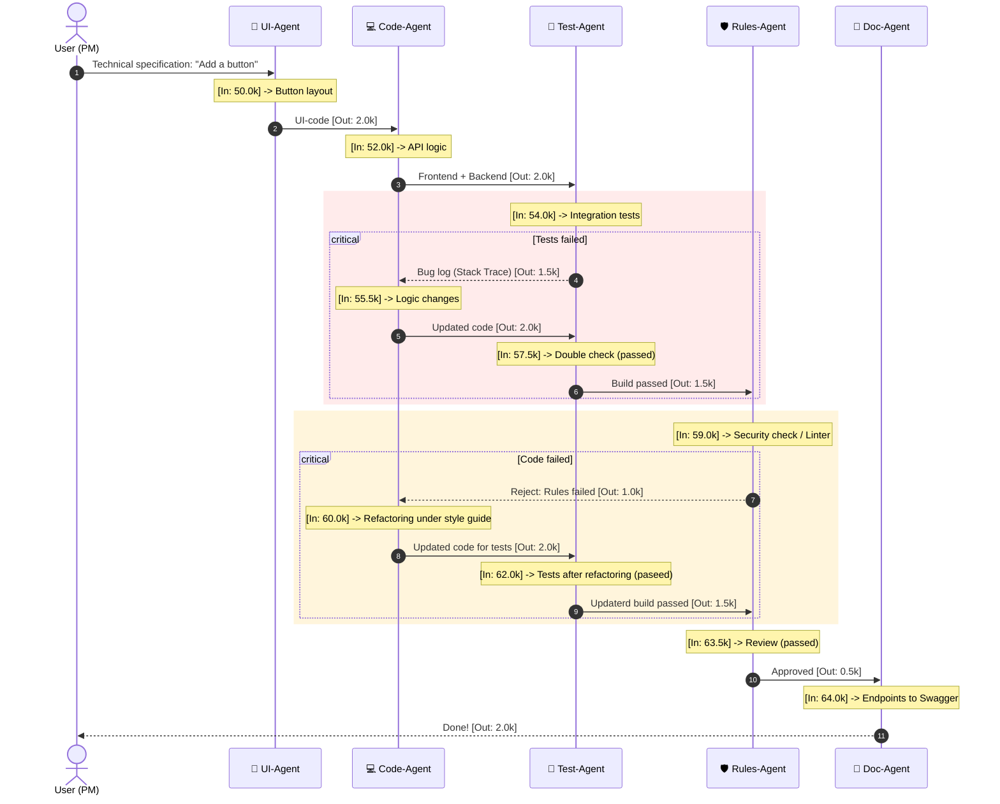

```mermaid
sequenceDiagram
    autonumber
    actor User as User (PM)
    participant UI_Agent as 🎨 UI-Agent
    participant Code_Agent as 💻 Code-Agent
    participant Test_Agent as 🧪 Test-Agent
    participant Rules_Agent as 🛡️ Rules-Agent
    participant Doc_Agent as 📝 Doc-Agent

    User->>UI_Agent: Technical specification: "Add a button"
    note over UI_Agent: [In: 50.0k] -> Button layout
    UI_Agent->>Code_Agent: UI-code [Out: 2.0k]
    
    note over Code_Agent: [In: 52.0k] -> API logic
    Code_Agent->>Test_Agent: Frontend + Backend [Out: 2.0k]
    
    %% Section 1: Bugs and double check
    rect rgb(255, 235, 235)
        note over Test_Agent: [In: 54.0k] -> Integration tests
        critical Tests failed
            Test_Agent-->>Code_Agent: Bug log (Stack Trace) [Out: 1.5k]
            note over Code_Agent: [In: 55.5k] -> Logic changes
            Code_Agent->>Test_Agent: Updated code [Out: 2.0k]
            note over Test_Agent: [In: 57.5k] -> Double check (passed)
            Test_Agent->>Rules_Agent: Build passed [Out: 1.5k]
        end
    end

    %% Section 2: Review error, fixand and test
    rect rgb(255, 245, 220)
        note over Rules_Agent: [In: 59.0k] -> Security check / Linter
        critical Code failed
            Rules_Agent-->>Code_Agent: Reject: Rules failed [Out: 1.0k]
            note over Code_Agent: [In: 60.0k] -> Refactoring under style guide
            Code_Agent->>Test_Agent: Updated code for tests [Out: 2.0k]
            
            note over Test_Agent: [In: 62.0k] -> Tests after refactoring (paseed)
            Test_Agent->>Rules_Agent: Updaterd build passed [Out: 1.5k]
        end
    end

    note over Rules_Agent: [In: 63.5k] -> Review (passed)
    Rules_Agent->>Doc_Agent: Approved [Out: 0.5k]
    
    note over Doc_Agent: [In: 64.0k] -> Endpoints to Swagger
    Doc_Agent-->>User: Done! [Out: 2.0k]
```
