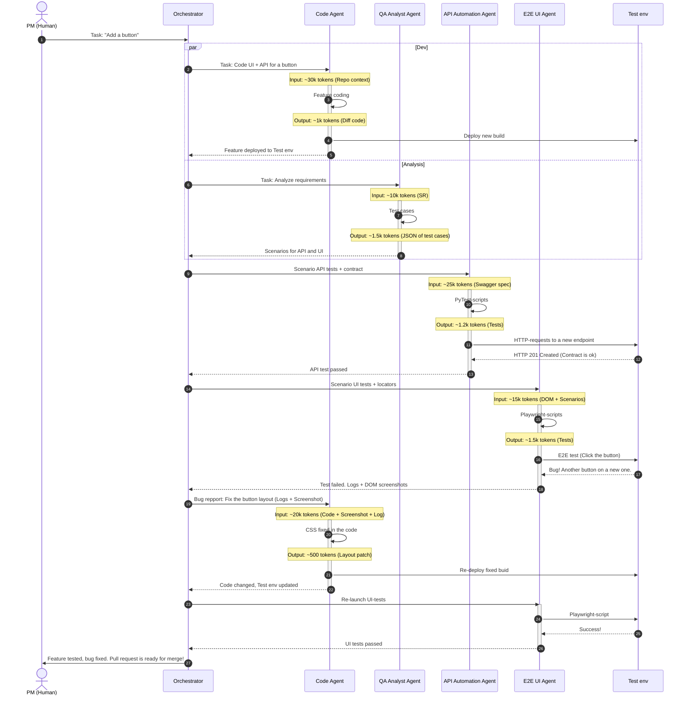

```mermaid
sequenceDiagram
    autonumber
    actor Lead as PM (Human)
    participant Orch as Orchestrator
    participant Dev_Agent as Code Agent
    participant QA_Analyst as QA Analyst Agent
    participant API_Agent as API Automation Agent
    participant UI_Agent as E2E UI Agent
    participant Env as Test env
    
    %% Start
    Lead->>Orch: Task: "Add a button"
    
    %% Dev and Analysis are parallel
    par Dev
        Orch->>Dev_Agent: Task: Code UI + API for a button
        Note over Dev_Agent: Input: ~30k tokens (Repo context)
        activate Dev_Agent
        Dev_Agent->>Dev_Agent: Feature coding
        Note over Dev_Agent: Output: ~1k tokens (Diff code)
        Dev_Agent->>Env: Deploy new build
        Dev_Agent-->>Orch: Feature deployed to Test env
        deactivate Dev_Agent
    and Analysis
        Orch->>QA_Analyst: Task: Analyze requirements
        Note over QA_Analyst: Input: ~10k tokens (SR)
        activate QA_Analyst
        QA_Analyst->>QA_Analyst: Test cases
        Note over QA_Analyst: Output: ~1.5k tokens (JSON of test cases)
        QA_Analyst-->>Orch: Scenarios for  API and UI
        deactivate QA_Analyst
    end
    
    %% Testing API
    Orch->>API_Agent: Scenario API tests + contract
    Note over API_Agent: Input: ~25k tokens (Swagger spec)
    activate API_Agent
    API_Agent->>API_Agent: PyTest-scripts
    Note over API_Agent: Output: ~1.2k tokens (Tests)
    API_Agent->>Env: HTTP-requests to a new endpoint
    Env-->>API_Agent: HTTP 201 Created (Contract is ok)
    API_Agent-->>Orch: API test passed
    deactivate API_Agent
    
    %% Testing UI (Scenario with a bug and Self-Fixing)
    Orch->>UI_Agent: Scenario UI tests + locators
    Note over UI_Agent: Input: ~15k tokens (DOM + Scenarios)
    activate UI_Agent
    UI_Agent->>UI_Agent: Playwright-scripts
    Note over UI_Agent: Output: ~1.5k tokens (Tests)
    UI_Agent->>Env: E2E test (Click the button)
    Env-->>UI_Agent: Bug! Another button on a new one.
    UI_Agent-->>Orch: Test failed. Logs + DOM screenshots
    deactivate UI_Agent
    
    %% Self-Fixing
    Orch->>Dev_Agent: Bug repport: Fix the button layout (Logs + Screenshot)
    Note over Dev_Agent: Input: ~20k tokens (Code + Screenshot + Log)
    activate Dev_Agent
    Dev_Agent->>Dev_Agent: CSS fixed in the code
    Note over Dev_Agent: Output: ~500 tokens (Layout patch)
    Dev_Agent->>Env: Re-deploy fixed buid
    Dev_Agent-->>Orch: Code changed, Test env updated
    deactivate Dev_Agent
    
    %% Double check UI
    Orch->>UI_Agent: Re-launch UI-tests
    activate UI_Agent
    UI_Agent->>Env: Playwright-script
    Env-->>UI_Agent: Success!
    UI_Agent-->>Orch: UI tests passed
    deactivate UI_Agent
    
    %% Final
    Orch->>Lead: Feature tested, bug fixed. Pull request is ready for merge!
```
