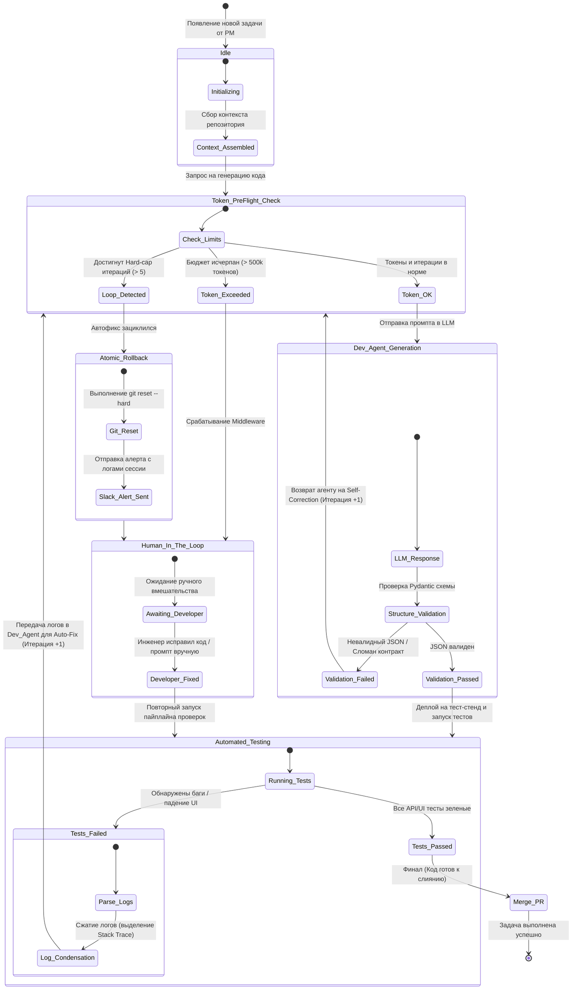

```mermaid
stateDiagram-v2
 [*] --> Idle : Появление новой задачи от PM
 
 state Idle {
    [*] --> Initializing
    Initializing --> Context_Assembled : Сбор контекста репозитория
 }
 
 Context_Assembled --> Token_PreFlight_Check : Запрос на генерацию кода
 
 state Token_PreFlight_Check {
    [*] --> Check_Limits
    Check_Limits --> Token_OK : Токены и итерации в норме
    Check_Limits --> Token_Exceeded : Бюджет исчерпан (> 500k токенов)
    Check_Limits --> Loop_Detected : Достигнут Hard-cap итераций (> 5)
 }
 
 Token_Exceeded --> Human_In_The_Loop : Срабатывание Middleware
 Loop_Detected --> Atomic_Rollback : Автофикс зациклился
 Token_OK --> Dev_Agent_Generation : Отправка промпта в LLM
 
 state Dev_Agent_Generation {
    [*] --> LLM_Response
    LLM_Response --> Structure_Validation : Проверка Pydantic схемы
    Structure_Validation --> Validation_Failed : Невалидный JSON / Сломан контракт
    Structure_Validation --> Validation_Passed : JSON валиден
 }
 
 Validation_Failed --> Token_PreFlight_Check : Возврат агенту на Self-Correction (Итерация +1)
 Validation_Passed --> Automated_Testing : Деплой на тест-стенд и запуск тестов
 
 state Automated_Testing {
    [*] --> Running_Tests
    Running_Tests --> Tests_Passed : Все API/UI тесты зеленые
    Running_Tests --> Tests_Failed : Обнаружены баги / падение UI
 }
 
 Tests_Passed --> Merge_PR : Финал (Код готов к слиянию)
 Merge_PR --> [*] : Задача выполнена успешно
 
 state Tests_Failed {
    [*] --> Parse_Logs
    Parse_Logs --> Log_Condensation : Сжатие логов (выделение Stack Trace)
 }
 
 Log_Condensation --> Token_PreFlight_Check : Передача логов в Dev_Agent для Auto-Fix (Итерация +1)
 
 state Atomic_Rollback {
    [*] --> Git_Reset : Выполнение git reset --hard
    Git_Reset --> Slack_Alert_Sent : Отправка алерта с логами сессии
 }
 
 Atomic_Rollback --> Human_In_The_Loop
 
 state Human_In_The_Loop {
    [*] --> Awaiting_Developer : Ожидание ручного вмешательства
    Awaiting_Developer --> Developer_Fixed : Инженер исправил код / промпт вручную
 }
 
  Developer_Fixed --> Automated_Testing : Повторный запуск пайплайна проверок
```
